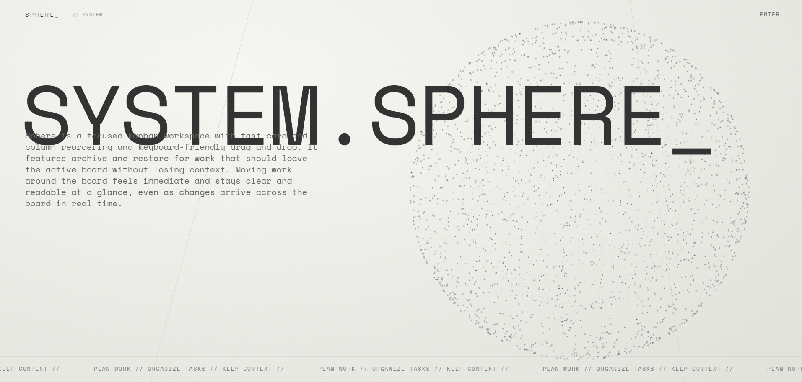
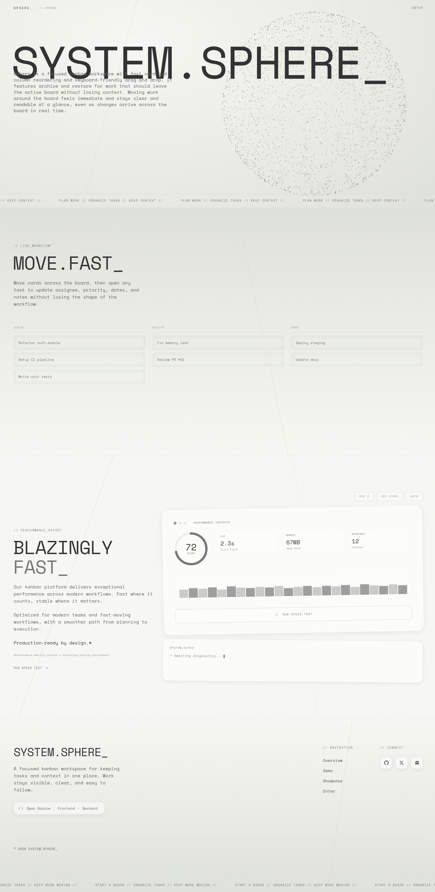
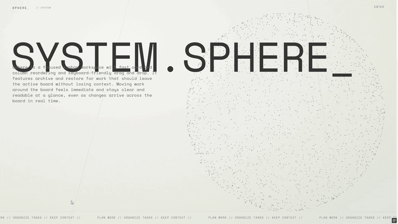

# Collaborative Kanban Backend | Sphere

Collaborative kanban backend built with ASP.NET Core and PostgreSQL.

The project was built around a constraint that usually creates hidden complexity: a collaborative board should stay responsive while multiple users create, reorder, archive, restore, and inspect work at the same time. The backend combines feature handlers, PostgreSQL-backed consistency rules, short-lived JWT access tokens, cookie-based refresh sessions, and SSE board events so the frontend can stay fast without pushing business rules into the client.

This repository contains the backend API. The frontend lives here:
- [Sphere frontend](https://github.com/webdm0/sphere-frontend)

## Demo

The screenshots below are from the companion frontend and show the product flows powered by this API.

### Landing


<details>
<summary>See the full landing page</summary>


</details>

### Boards


### Board Workspace


### Card Modal


### Auth
<p>
  
  
</p>

### Walkthrough Video
A short walkthrough shows the product flow end to end: sign-in flow, board creation, columns, cards, drag-and-drop ordering, card editing, and board updates.

- Video: [View walkthrough](https://github.com/webdm0/sphere-frontend/releases/download/project-overview/project-overview.mp4)

### Live Demo

The hosted version is optimized for quick review through instant demo access. Use **Try Demo** on the auth screen to enter a temporary account and test the board workflow without creating credentials.



- Live app: [View live demo](https://sphere-workspace.vercel.app/)

Demo sessions last 1 hour and are cleaned up automatically. Some account-to-account collaboration features are disabled for demo users. Full email confirmation is implemented in the backend; the hosted demo focuses on instant demo access instead of public signup.

> The backend runs on free-tier hosting and may take up to about a minute to wake up after inactivity.

## What's In The API

- auth endpoints for register, login, logout, email confirmation, session validation, and refresh
- cookie-based refresh sessions with server-side session records and hashed refresh tokens
- short-lived JWT access tokens for protected API requests
- demo session creation, expiration checks, and cleanup of demo-owned data
- board creation with default `Queue`, `Active`, and `Done` columns
- boards index, archived boards, board restore, and permanent board deletion
- board invites, accept/decline flows, shared board access, leave shared board, and member management
- user search for collaboration flows
- column creation, editing, archive, restore, permanent delete, and reorder
- card creation, editing, assignee changes, priority and date fields, archive, restore, permanent delete, and reorder
- board-level read access checks for owners and accepted members
- SSE-based board events for collaborative resync
- ProblemDetails-based error responses and retry metadata for rate-limited auth flows
- background cleanup for expired demo accounts and expired unconfirmed accounts

## Why It Was Built This Way

- `Controller -> Handler -> DbContext / Service`: controllers stay thin while feature handlers own the request-specific behavior.
- `Feature folders over generic layers`: auth, boards, columns, cards, events, and users are grouped by product capability instead of by technical type only.
- `Access + refresh auth model`: protected API requests use short-lived bearer tokens, while refresh state lives in HttpOnly cookies and server-side session rows.
- `Server-side session authority`: refresh tokens are rotated, stored only as hashes, and tied to user sessions that can be deleted independently.
- `Demo access without signup`: demo accounts are real users with a short lifetime, clear restrictions, and cleanup paths that remove expired data.
- `PostgreSQL order guards`: board, column, card, and membership order mutations use unique indexes plus advisory locks to reduce race conditions.
- `Archive before permanent delete`: boards, columns, and cards keep closed work inspectable before irreversible deletion.
- `Real-time sync without controller leakage`: SSE connection state, replay, heartbeats, and optional distributed relay live in infrastructure services.
- `Explicit API error shape`: validation and application errors are normalized into ProblemDetails so the frontend gets predictable failures.

## Stack

- ASP.NET Core 8 Web API
- Entity Framework Core 8 with PostgreSQL through Npgsql
- JWT Bearer authentication
- HttpOnly refresh cookies with server-side `UserSession` records
- BCrypt.Net for password hashing
- Hashids.net for public-facing encoded IDs
- AutoMapper for DTO projection and encoded ID mapping
- Resend for confirmation email delivery
- DataAnnotations plus handler-level validation
- Server-Sent Events for board updates
- Dockerized backend deployment on Render
- Neon PostgreSQL for the hosted database
- Companion frontend deployed on Vercel
- xUnit, `WebApplicationFactory`, and PostgreSQL-backed integration tests

## Where To Look In Code

- [`SphereBackend/Program.cs`](./SphereBackend/Program.cs): application startup, config validation, auth, DI, CORS, EF Core, and hosted services
- [`SphereBackend/Controllers/AuthController.cs`](./SphereBackend/Controllers/AuthController.cs): auth endpoint surface
- [`SphereBackend/Controllers/BoardsController.cs`](./SphereBackend/Controllers/BoardsController.cs): board, invite, archive, restore, and member endpoint surface
- [`SphereBackend/Features/Auth/Shared/AuthFlowService.cs`](./SphereBackend/Features/Auth/Shared/AuthFlowService.cs): JWT creation, refresh cookies, session creation, confirmation email helpers, and auth rate-limit state
- [`SphereBackend/Features/Auth/CreateDemoSession/CreateDemoSessionHandler.cs`](./SphereBackend/Features/Auth/CreateDemoSession/CreateDemoSessionHandler.cs): demo account creation and demo rate limiting
- [`SphereBackend/Infrastructure/Persistence/AppDbContext.cs`](./SphereBackend/Infrastructure/Persistence/AppDbContext.cs): EF Core model, indexes, user normalization, and DbSet declarations
- [`SphereBackend/Infrastructure/Persistence/BoardOrderGuardExtensions.cs`](./SphereBackend/Infrastructure/Persistence/BoardOrderGuardExtensions.cs): PostgreSQL advisory-lock guards for reorder-safe mutations
- [`SphereBackend/Infrastructure/Events/BoardEventService.cs`](./SphereBackend/Infrastructure/Events/BoardEventService.cs): SSE subscriptions, replay buffer, heartbeats, disconnects, and optional PostgreSQL relay
- [`SphereBackend/Features/Cards/ReorderCards/ReorderCardsHandler.cs`](./SphereBackend/Features/Cards/ReorderCards/ReorderCardsHandler.cs): moving cards within and across columns
- [`SphereBackend/Features/Columns/RestoreColumn/RestoreColumnHandler.cs`](./SphereBackend/Features/Columns/RestoreColumn/RestoreColumnHandler.cs): restoring columns and automatically archived cards
- [`SphereBackend.IntegrationTests/CustomWebApplicationFactory.cs`](./SphereBackend.IntegrationTests/CustomWebApplicationFactory.cs): integration test host, test database lifecycle, and test authentication

## Running It Locally

This backend is meant to run together with the frontend repository.

1. Install the .NET 8 SDK and make sure PostgreSQL is running.
2. Create `SphereBackend/.env` from [`SphereBackend/.env.example`](./SphereBackend/.env.example).
3. Fill the required values:
   - `ConnectionStrings__DefaultConnection`
   - `Hashids__Salt`
   - `Jwt__Key`
   - `SessionHint__Key`
   - `Resend__ApiKey`
   - `Resend__FromEmail` (`Development` can fall back to `onboarding@resend.dev`, but set this explicitly if you want production-like email configuration locally)
4. Set `Frontend__BaseUrl` and `AllowedOrigins__0` to the frontend origin, for example `https://localhost:3000`.
5. Set `SessionHint__Key` to a secret value different from `Jwt__Key`. In the frontend repository, the server-only `SESSION_HINT_KEY` should use the same value so Next.js middleware can validate the backend-issued `__session_hint` cookie. Do not expose this value through `NEXT_PUBLIC_*` variables.
6. Restore dependencies, apply migrations, and start the backend:

```bash
dotnet restore ./SphereBackend.sln
dotnet ef database update --project ./SphereBackend/SphereBackend.csproj --startup-project ./SphereBackend/SphereBackend.csproj
dotnet run --project ./SphereBackend/SphereBackend.csproj
```

Then start the frontend by following the setup in the [frontend repository](https://github.com/webdm0/sphere-frontend).

Optional environment variables:
- `Cookies__UseCrossSiteAuth=true` only when the browser calls the backend directly from another site
- `SessionHint__TtlSeconds` for the short-lived session hint cookie lifetime
- `SessionHint__Issuer` and `SessionHint__Audience` for stricter session hint validation when the frontend also sets `SESSION_HINT_ISS` and `SESSION_HINT_AUD`
- `Sse__AllowQueryStringToken=true` for local SSE debugging only
- `Sse__EnableDistributedRelay=true` to relay SSE events between backend instances through PostgreSQL `LISTEN/NOTIFY`
- `PORT` to bind the app to `http://0.0.0.0:<PORT>` in hosted environments
- `ASPNETCORE_FORWARDEDHEADERS_ENABLED=true` when the app runs behind a reverse proxy that forwards scheme and client IP headers

Quality checks:

```bash
dotnet build ./SphereBackend.sln -c Release --no-restore
dotnet test ./SphereBackend.sln -c Release --no-build --no-restore
```

Unit tests run as-is, but integration tests require PostgreSQL configuration through `IntegrationTests__DefaultConnection`, `ConnectionStrings__DefaultConnection`, or `SphereBackend/.env`.
